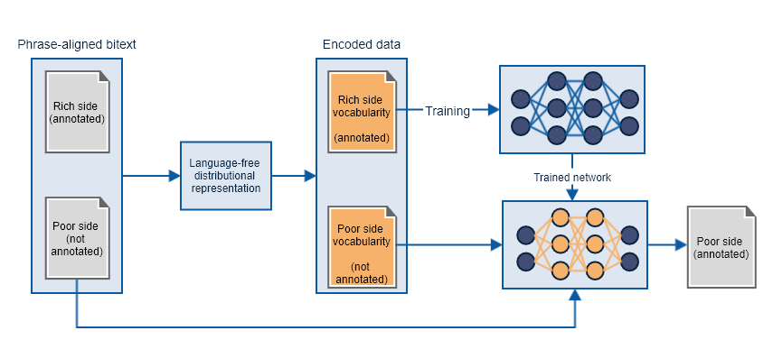

# Word2vec-For-NER-In-Low-Resource-Languages
An efficient language-free distributionnal representation for the projection of named entities from a rich language to low-resource languages. Checkout the paper for more details

# Process flow diagram

# Repository description
- The `data` folder contains the annotations of the corpus using [Brat](https://brat.nlplab.org/index.html).
- The `result` folder contains the results (F1, Precision, Recall) by tag for the 10 repetitions of the training. The file (results.csv)[https://github.com/frankl1/Word2vec-For-NER-In-Low-Resource-Languages/blob/master/results.csv] constains the averaged results for the 10 repetitions.
- The jupyter notebook [brat2corpus.ipynb](https://github.com/frankl1/Word2vec-For-NER-In-Low-Resource-Languages/blob/master/brat2corpus.ipynb) is used to convert brat annotation to two parallel copora [corpus-ewo.txt](https://github.com/frankl1/Word2vec-For-NER-In-Low-Resource-Languages/blob/master/corpus-ewo.txt) (for the Ewondo side) and [corpus-en.txt](https://github.com/frankl1/Word2vec-For-NER-In-Low-Resource-Languages/blob/master/corpus-en.txt) (for the English side). Each line in these file is a token with its associated annotation. Blank lines denote the end of a phrase (verse in our case). The two files are aligned such that a phrase and its translation are at the same position.
- The jupyter notebooks [fnn-ne-projection-corpus-based-tf.ipynb](https://github.com/frankl1/Word2vec-For-NER-In-Low-Resource-Languages/blob/master/fnn-ne-projection-corpus-based-tf.ipynb), [fnn-ne-projection-phrase-based.ipynb](https://github.com/frankl1/Word2vec-For-NER-In-Low-Resource-Languages/blob/master/fnn-ne-projection-phrase-based.ipynb), and [fnn-ne-projection-side-based.ipynb](https://github.com/frankl1/Word2vec-For-NER-In-Low-Resource-Languages/blob/master/fnn-ne-projection-side-based.ipynb) are the source codes used to train the model and compute performances using respectively the *corpus-based term frequency*, the *phrase-based term frequency*, and the *side-based term frequency*.

# Reproduce the experiment
After cloning this repository, `conda` can be used to install all the dependencies with the command `conda env create -f requirements.yml`

# Citing this work
~~~
@article{mbouopda2020named,
  title={Named Entity Recognition in Low-resource Languages using Cross-lingual distributional word representation},
  author={Mbouopda, Michael Franklin and Melatagia Yonta, Paulin},
  journal={Revue Africaine de la Recherche en Informatique et Math{\'e}matiques Appliqu{\'e}es},
  volume={33},
  year={2020},
  publisher={Episciences. org}
}
